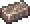
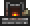
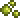
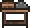
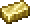
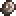

Michaelangel007's Terraria Crafting Cheat Sheet

By Michaelangel007 / /u/mysticreddit
Copyleft {C} 2022

# Table of Contents

* [Essential Crafting](https://github.com/Michaelangel007/terraria_cheat_sheet#essential-crafting)
* [Architect Gizmo Pack Crafting](https://github.com/Michaelangel007/terraria_cheat_sheet#architect-gizmo-pack-crafting)
* [Boot Crafting](https://github.com/Michaelangel007/terraria_cheat_sheet#boot-crafting)
* [Cell Phone Crafting](https://github.com/Michaelangel007/terraria_cheat_sheet#cell-phone-crafting)

# Essential Crafting

| Icon                                | Item                        |Crafted At | Wood                    | Iron                        | Misc. / Notes                 |
|:-----------------------------------:|:----------------------------|:----------|------------------------:|----------------------------:|:------------------------------|
||Ale                          |Keg        |       <meta           />|       <meta               />| 1 Mug        |
||Anvil                        |Work Bench |       <meta           />| 5 Iron|                               |
||Barrel                       |Sawmill    | 9 Wood| 1 Iron|                               |
||Bed                          |Sawmill    |15 Wood|       <meta               />| 5 Silk  (35 Cobwebs)              |
||Bottle (2)                   |Furance    |       <meta           />|       <meta               />| 1 Glass                          |
||Bucket                       |Anvil      |       <meta           />| 3 Iron|                                                     |
||Campfire                     |By Hand    |10 Wood|       <meta               />| 5 Torch                          |
||Campire, Ultrabright         |By Hand    |10 Wood|       <meta               />| 5 Ultrabright Torch  |
||Chain (10)                   |Anvil      |       <meta           />| 1 Iron|                               |
||Chair                        |Work Bench | 4 Wood|       <meta               />|                               |
||Chest                        |Work Bench | 8 Wood| 2 Iron|                               |
||Cooking Pot                  |Anvil      | 2 Wood|10 Iron|                               |
||Door                         |Work Bench | 6 Wood|       <meta               />|                               |
||Enchanted Nightcrawler       |By Hand    |       <meta           />|       <meta               />| 1 Worm , 1 Fallen Star  |
||Fishing Pole, Fisher of Souls|Anvil      |       <meta           />|       <meta               />| 8 Demonite Bars              |
||Fishing Pole, Reinforced     |Anvil      |       <meta           />| 8 Iron|                                                        |
||Fishing Pole, Fleshcatcher   |Anvil      |       <meta           />|       <meta               />| 8 Crimtane Bars              |
||Furnace                      |Work Bench | 4 Wood|       <meta               />| 20 Stone Block , 3 Torches  |
||Gemcorn                      |By Hand    |       <meta           />|       <meta               />| 1 Acorn , 1 Gem  (Underground/Cavern) |
||Glass                        |Furance    |       <meta           />|       <meta               />| 2 Sand Block                                    |
||Glass Kiln                   |Anvil      |       <meta           />|18 Iron| |
||Golden Fishing Rod           |n/a        |       <meta           />|       <meta               />|Angler 30 Fishing Quests reward|
||Grappling Hook               |Anvil      |       <meta           />|       <meta               />| 3 Chain , 1 Hook  |
||Grappling Hook, Diamond      |Anvil      |       <meta           />|       <meta               />| 15 Diamonds                       |
||Grappling Hook, Ivy Whip     |Anvil      |       <meta           />|       <meta               />| 12 Jungle Spores , 3 Vines  |
||Heart Lantern                |By Hand    |       <meta           />|       <meta               />| 4 Chain , 1 Life Crystal   |
||Keg                          |Sawmill    |14 Wood|       <meta               />|                               |
||Loom                         |Sawmill    |12 Wood|       <meta               />|                               |
||Magiluminescence             |Anvil      |       <meta           />|       <meta               />| 5 Topaz , 12 Demonite Bar |
||Minecart                     |Anvil      |10 Wood|15 Iron| |
||Minecart Track (50)          |Anvil      | 1 Wood| 1 Iron| |
||Mug                          |Furance    |       <meta           />|       <meta               />| 1 Glass                        |
||Placed Bottle                |Platform   |       <meta           />|       <meta               />| 1 Bottle                      |
||Rope, Silk                   |Loom       |       <meta           />|       <meta               />| 1 Silk                          |
||Rope, Vine                   |By Hand    |       <meta           />|       <meta               />|Guide to Plant Fiber Cordage   |
||Rope, Web                    |By Hand    |       <meta           />|       <meta               />| 1 Cobweb                      |
||Sawmill                      |Work Bench |10 Wood| 2 Iron| 1 Chain                        |
||Silk                         |Loom       |       <meta           />|       <meta               />| 7 Cobwebs                     |
||Star in a Bottle             |By Hand    |       <meta           />|       <meta               />| 1 Bottle , 1 Fallen Star  |
||Table                        |Work Bench | 7 Wood|       <meta               />|                               |
||Torch (3)                    |By Hand    | 1 Wood|       <meta               />| 3 Gel                         |
||Torch, Ultrabright           |n/a        |       <meta           />|       <meta               />| Sold by Traveling Merchant    |
||Trap Door                    |Work Bench | 8 Wood| 4 Iron|                               |
||Vine                         |n/a        |       <meta           />|       <meta               />|Dropped by Jungle Man Eaters   |
||Watch, Gold                  |Table Chair|       <meta           />|       <meta               />|10 Gold Bars , 1 Chain  |
||Watch, Platinum              |Table Chair|       <meta           />|       <meta               />|10 Platinum Bars , 1 Chain  |
||Work Bench                   |By Hand    |10 Wood|       <meta               />|                               |
||Work Bench, Heavy            |Anvil      |12 Wood| 8 Iron|                               |

# Architect Gizmo Pack Crafting

| Component            | Craft at / Found    | Ingrediants                                                     |
|:---------------------|:--------------------|:----------------------------------------------------------------|
| Architect Gizmo Pack | Tinkerer's Workshop | Brick Layer, Extendo Grip, Paint Sprayer, Portable Cement Mixer |
| Brick Layer          | Traveling Merchant  | 10g                                                             |
| Extendo Grip         | Traveling Merchant  | 10g                                                             |
| Paint Sprayer        | Traveling Merchant  | 10g                                                             |
| Portable Cement Mixer| Traveling Merchant  | 10g                                                             |

# Boot Crafting

| Component            | Craft at / Found    | Ingrediants                                                     |
|:---------------------|:--------------------|:----------------------------------------------------------------|
| Amphibian Boots      | Tinkerer's Workshop | Frog Leg, Sailfish Boots                                  |
| Climbing Claws       | Chest / Fishing     | Surface Chest, Water Chest, Wooden Crate, Pearlwood Crate |
| Dunerider Boots      | Chest / Fishing     | Sandstone Chest, Oasis Crate, Mirage Crate                |
| Fairy Boots          | Tinkerer's Workshop | Spectre Boots, Flower Boots                               |
| Flipper              | Chest / Fishing     | Water Chests, Ocean Crate, Seaside Crate                  |
| Flurry Boots         | Chest / Fishing     | Frozen Chest, Frozen Crate, Boreal Crate                  |
| Frog Gear            | Tinkerer's Workshop | Frog Webbing, Flipper                                     |
| Frog Leg             | Fishing             | Drop rate: 0.4%                                           |
| Frog Webbing         | Tinkerer's Workshop | Frog Leg, Tiger Climbing Gear                             |
| Lightning Boots      | Tinkerer's Workshop | Spectre Boots, Anklet of the Wind, Aglet                  |
| Rocket Boots         | Goblin Tinkerer     | 5g                                                        |
| Sailfish Boots       | Fishing             | Wooden Crate, Iron Crate, Pearlwood Crate, Mythril Crate  |
| Shoe Spikes          | Chest               | Gold Chest Underground, Rich Mahogany Chest               |
| Spectre Boots        | Tinkerer's Workshop | Rocket Boots, Dunerider Boots                             |
| Spectre Boots        | Tinkerer's Workshop | Rocket Boots, Flurry Boots                                |
| Spectre Boots        | Tinkerer's Workshop | Rocket Boots, Hermes Boots                                |
| Spectre Boots        | Tinkerer's Workshop | Rocket Boots, Sailfish Boots                              |
| Tiger Climbing Gear  | Tinkerer's Workshop | Climbing Claws, Shoe Spikes                               |

# Cell Phone Crafting

| Component        | Craft at / Found at | Ingrediants                                        |
|:-----------------|:--------------------|:---------------------------------------------------|
| Angler Tackle Bag| Tinkerer's Workshop | Angler Earring, High Test Fishing Line, Tackle Box |
| Cell Phone       | Tinkerer's Workshop | PDA, Magic Mirror                                  |
| Compass          | mob drop            | Crawdad, Salamander, Viking                        |
| Depth Meter      | mob drop            | Bats, Crawdad, Salamander                          |
| DPS Meter        | Traveling Merchant  | 5g                                                 |
| Fish Finder      | Tinkerer's Workshop | Fisherman's Pocket Guide, Weather Radio, Sextant   |
| Goblin Tech      | Tinkerer's Workshop | DPS Meter, Metal Detector, Stopwatch               |
| Gold Watch       | Table + Chair       | 10 Gold Bar, 1 Chain                               |
| GPS              | Tinkerer's Workshop | Gold Watch, Depth Meter, Compass                   |
| Lifeform Analyzer| Traveling Merchant  | 5g                                                 |
| Metal Detector   | mob drop            | Nymph                                              |
| PDA              | Tinkerer's Workshop | GPS, Fisher Finder, Goblin Tech, R.E.K. 3000       |
| Radar            | Wooden Crate / Chest|                                                    |
| R.E.K. 3000      | Tinkerer's Workshop | Lifeform Analyzer, Radar, Tally Counter            |
| Stopwatch        | Traveling Merchant  | 5g                                                 |
| Tally Counter    | mob drop            | Angry Bones, Cursed Skull, Dark Caster             |

# Ores

| Tier | Ore          |
|-----:|:-------------|
|   17 |  <meta     /> Copper /  Tin   |
|   16 |  <meta       /> Iron   /  Lead |
|   15 |  <meta     /> Silver      |
|   14 |  <meta   /> Tungsten    |
|   13 |  <meta       /> Gold        |
|   12 |  <meta   /> Platinum    |
|   11 |  <meta  /> Meteorite   |
|   10 |  <meta   /> Demonite /  Crimtane |
|    9 |  <meta  /> Hellstone   |
|    8 |  <meta     /> Cobalt      |
|    7 |  <meta  /> Palladium   |
|    6 |  <meta    /> Mythril     |
|    5 |  <meta /> Orichalcum  |
|    4 |  <meta /> Adamantite  |
|    3 |  <meta   /> Titanium    |
|    2 |  <meta/> Chlorophyte |
|    1 |  <meta   /> Luminite    |

Version 1.1, Last updated: Sat, oct 8, 2022.
